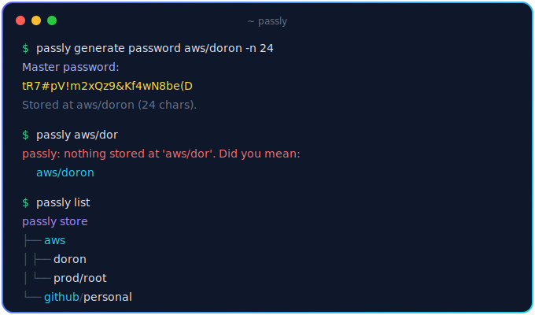

<div align="center">


<br/>

**Passly is a zero-dependency command-line vault for passwords and private documents.**
Every secret lives as its own AES-256-GCM encrypted file, organized in folders like `aws/admin`,
unlocked by a single master password — and because the vault is just a directory of ciphertext,
it syncs anywhere through git.

<br/>


<br/>



</div>

---

## Why passly?

- 🔐 **One password, everything sealed.** Each entry is encrypted on its own — fresh scrypt salt and IV per file, GCM-authenticated so tampering is detected. Nothing ever touches disk in plaintext.
- 🗂 **Secrets that nest like folders.** `aws/admin`, `work/gcp/service-account` — browse them as a tree, fetch them by path.
- 💡 **It meets you halfway.** Typo a name and passly suggests the closest matches; hit a folder and it shows you what's inside.
- ☁️ **Sync without a service.** The vault is a git repo of ciphertext — push it to a private GitHub repo and pull it on every machine you own. No server, no subscription, no trust in anyone's cloud.
- 🪶 **Zero dependencies.** ~600 lines of Node.js and nothing in `node_modules`. Audit it over coffee.

## Install

```sh
git clone https://github.com/admin2402/passly.git && cd passly
npm link          # or: npm install -g .
passly init       # pick your master password — it encrypts everything
```

The vault lives at `~/.passly` (override with `PASSLY_HOME`).

## Usage

```sh
# Generate, store and print a password
passly generate aws/admin -n 24
passly generate github/personal --no-symbols

# Fetch a secret — bare path works
passly aws/admin
passly get aws/admin -c          # copy to clipboard instead of printing

# Store something you already have (hidden prompt)
passly insert stripe/live-key

# Store a document / file, encrypted
passly insert aws/ssh-key -f ~/.ssh/id_rsa

# Browse
passly list
passly list aws

# Delete
passly rm github/personal

# Change the master password — re-encrypts every entry with the new one
passly passwd
```

### Suggestions

Typos get you close matches, and hitting a folder shows what's inside:

```
$ passly aws/dor
passly: nothing stored at 'aws/dor'. Did you mean:
  aws/admin

$ passly aws
passly: 'aws' is a folder. Entries inside:
  aws/admin
  aws/prod/root
```

## Sync with GitHub

Create a **private** repo on GitHub, then:

```sh
passly sync setup git@github.com:you/passly-vault.git   # one time
passly sync                                             # commit + pull + push
passly sync status                                      # what would sync
```

Once linked, every `generate`, `insert`, `rm` and `passwd` auto-commits locally;
`passly sync` pushes those commits and pulls changes from other machines.
Only ciphertext ever leaves your machine — GitHub sees `.pass` blobs it can't read.

On a second machine, clone the repo as your vault and use the same master password:

```sh
git clone git@github.com:you/passly-vault.git ~/.passly
```

If both machines change the same entry, `passly sync` reports the conflict and leaves
the vault untouched — resolve it in `~/.passly` like any git conflict, then sync again.

## Options

| Flag | Meaning |
|---|---|
| `-n <chars>` | Password length (default 20) |
| `--no-symbols` | Alphanumeric passwords only |
| `-c`, `--copy` | Copy to clipboard instead of printing |
| `-f <file>` | Read the secret's content from a file |

## Scripting

Set `PASSLY_PASSWORD` to skip the master-password prompt:

```sh
PASSLY_PASSWORD=... passly aws/admin
```

`passly passwd` also honors `PASSLY_PASSWORD` (current password) and
`PASSLY_NEW_PASSWORD` (new one) for non-interactive use.

## Security notes

- Your master password is never stored; a small encrypted verifier in `config.json` detects wrong passwords.
- Each `.pass` file carries its own scrypt salt + IV; GCM authentication detects tampering and corruption.
- Changing the master password stages every re-encrypted file first and swaps atomically — a failure mid-way leaves the vault untouched.
- Files are written `0600`, vault directories `0700`.
- Entry *names* are visible as filenames (that's what makes suggestions and git sync work) — keep the sync repo private.
- Losing the master password means losing the vault. There is no recovery. That's the point.

## Test

```sh
npm test
```

## License

MIT
